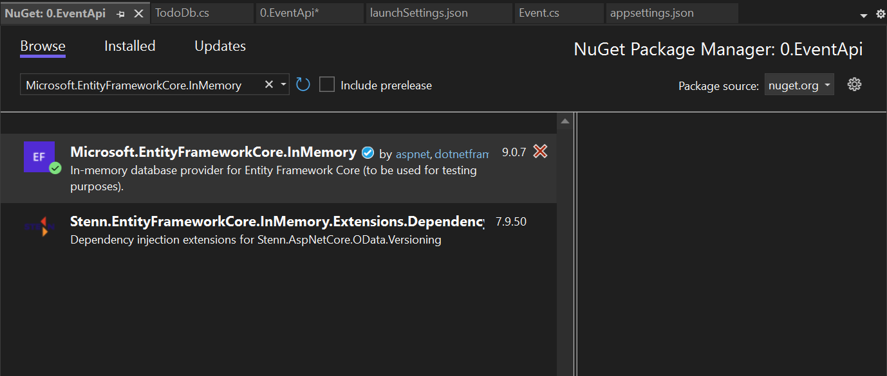

# Introduction to Minimal API

We will create an event API to build on the concept of minimal APIs. This API will help you learn about:

1. Project structure
2. REST API
3. CRUD Functionality

We will use an in-memory database for now, meaning the data will not be permanently saved to the database. When the application starts, it will clear any previous data. We will later connect to Microsoft SQL Server.

**Requirements**

1. Code Editor - Visual Studio is preferred
2. Fundamental concepts of C# language
3. Readiness to learn 🙂

## Step 1: Create an Empty .NET Core Project

## Step 2: What is Included in the Project and Running the Scaffolded Project

You should have the following code in the ***Program.cs*** file. Program.cs is the entry point of the application, and we will be referencing it several times.


- Press the keys Ctrl + F5 or click the "Run without debugging" button to run the application.
- You should have a browser launched with ***Hello World*** being displayed. This shows that the project configuration looks good.
- Let's break down the scaffolded project:

### **Properties/launchSettings.json**

This file tells Visual Studio or dotnet run how to launch the app during development, including:

* [ ] Ports
* [ ] Whether a browser should open
* [ ] Environment variables
* [ ] HTTPS or HTTP settings

**- Schema**

```json
 "$schema": "https://json.schemastore.org/launchsettings.json",
```

The above line defines the JSON Schema - this helps editors like VS Code with IntelliSense and validation.

**- Profiles**

Defines a way to run the application - we have two profiles: "http" and "https"

* [ ] ***commandName***: tells dotnet to launch the main project with dotnet run
* [ ] ***dotnetRunMessages***: shows the usual logs like ("now listening on http://")
* [ ] ***launchBrowser***: used to auto-launch the browser
* [ ] ***applicationUrl***: Port where the application will be running
* [ ] ***environmentVariables***: Sets the environment variables like "Development"

To avoid having the browser launch every time you run your project, head to the Properties folder and open the *launchSettings.json* file. You should see a property called ***launchBrowser: "true"***. Change that to ***launchBrowser: "false"*** for both the profiles (http and https).


The Dependencies folder will hold all the packages we will be installing from [NuGet Package Manager](https://www.nuget.org/)

**What is NuGet?**

NuGet is the package manager for .NET. The NuGet client tools provide the ability to produce and consume packages. The NuGet Gallery is the central package repository used by all package authors and consumers.

### Connected Services Folder

This folder provides tooling to connect your application to external services like:

* [ ] Web APIs - OpenAPI/Swagger for API calls
* [ ] gRPC services - Add and consume gRPC endpoints
* [ ] Azure Services - Connect to older SOAP/WCF services
* [ ] Databases - connect to a database and generate models with EF

### Program.cs File

This is the entry point of the application. Let's break it down:

1. **var builder = WebApplication.CreateBuilder(args);**

   - Used to create a ***WebApplicationBuilder*** instance
   - It configures services, logging, environment, and app settings

2. **var app = builder.Build();**

   - This builds the application
   - Creates a ***WebApplication*** instance, making the app ready to define endpoints and middlewares

3. **app.MapGet("/", () => "Hello World!");**

   - This is where you **define your first API endpoint**. Whenever you visit the endpoint, it returns "Hello World".
   - **() => "Hello World!"** - this is a lambda function that returns a string. Lambda is a concept in C#.

4. **app.Run();**

   - This **starts the web server**.
   - It starts listening for HTTP requests on the specified port(s)
   - It keeps the application running

## Step 3: Create Models Folder

Add a folder at the root of the project and name it Models. The Models folder will hold all the entities we will be using. An entity is similar to a table in relational databases.

Inside the newly created Models folder, add a class named Event. This will hold the properties of an event.


- All the fields are made public, meaning they can be accessed from anywhere in the application
- These properties are of different data types which simulate the real-world object of an event
- The string property has "?" because by default, all strings are nullable

### Concept of Nullable Reference Types

This is a concept that was introduced in C# 8.0. In older versions of C#, you could not be warned if there was a potential null value. With nullable reference types, C# became more strict and smart by helping you catch null issues at compile time.

- ***public string Description { get; set; }*** - This means that you guarantee that the Description will never be null. If you do not initialize any value, the compiler will warn you.
- ***public string? Description { get; set; }*** - This means that Description can be null. This tells the compiler that it's okay if the property is null, and it won't warn you.

#### Turning Nullable ON and OFF

This behavior is controlled by a setting in the .csproj file:

```xml
<Nullable>enable</Nullable>
```


[Read more about Nullable reference types](https://learn.microsoft.com/en-us/dotnet/csharp/language-reference/builtin-types/nullable-reference-types?WT.mc_id=studentamb_244628)

### .csproj File

This is an important file - it's like the heart of the project configuration. It is an XML file that defines:

- What files are part of the project
- What dependencies (NuGet packages) are needed
- What version of .NET to use
- Build settings, project properties, and more

## Step 4: EF Core and DB Context

### **Documentation/Resources**

[Official docs](https://learn.microsoft.com/en-us/ef/core/?WT.mc_id=studentamb_244628 "visit")

[Readme Presentation](https://github.com/kenya-data-platform-user-group/EF-Core-Presentation "visit")

[YouTube Tutorial by Nick Chapsas](https://www.youtube.com/watch?v=2t88FOeQ898 "visit")

### What is EF Core?

EF Core is a modern, open-source, and cross-platform **Object-Relational Mapper (ORM)** for .NET that eliminates the need to write complex SQL queries manually. It allows developers to work with databases using **C# classes and LINQ** instead of SQL.

EF Core acts as a bridge between **.NET applications** and **databases**, allowing developers to perform operations using object-oriented techniques.

#### Why EF Core?

##### 1. Quick Story/Example

Imagine you're building a .NET application and need to interact with a database. How do you do it efficiently? You could write raw SQL queries, but that can be error-prone and hard to maintain. This is where an ORM (Object-Relational Mapper) like EF Core comes in handy.

##### 2. How Do We Interact with Databases in .NET?

Before Entity Framework Core (EF Core), developers interacted with databases using **ADO.NET**, **Dapper**, or raw SQL queries. While these approaches provided control and performance, they often required writing a lot of boilerplate code for CRUD operations:

- Open a database connection
- Write SQL queries manually
- Handle result mappings to objects
- Manage transactions and exceptions explicitly

This process is repetitive and error-prone. This is where **EF Core** comes in.

##### 3. Why Use EF Core?

###### a. Simplifies Data Access

EF Core abstracts database interactions, allowing developers to use **C# objects** instead of SQL queries.

###### b. Boosts Productivity

- Eliminates the need to write repetitive SQL queries
- Supports **automatic migrations** to handle database schema changes
- Works seamlessly with **LINQ queries** for data retrieval

###### c. Supports Multiple Databases

EF Core is database-agnostic and supports multiple database providers, including:

- **SQL Server**
- **PostgreSQL**
- **MySQL**
- **SQLite**
- **Azure Cosmos DB**

### Setting Up EF Core

#### Step 1: Installing Database Provider

In Visual Studio, click on Tools → NuGet Package Manager and search for ***Microsoft.EntityFrameworkCore.InMemory*** and install it in your project.

**This is an Entity Framework Core (EF Core) provider** that allows you to use an **in-memory database**, mainly for **testing or prototyping**.



##### Limitations

- **No relational features** (e.g., foreign keys, joins, transactions)
- Doesn't always behave the same as real databases like SQL Server
- Not suitable for production

We will later advance to use other database providers.

#### Step 2: Installing EF Core Diagnostics

Search for ***Microsoft.AspNetCore.Diagnostics.EntityFrameworkCore*** and install it in your project.

It provides **developer-friendly error pages** for **Entity Framework Core-related exceptions**, especially during development, such as database errors, migration errors, and more.

This should **only be used in development** because it exposes detailed error information that could be a security risk in production.


##### When to Use

- When you want **better debugging support** for EF Core issues during development
- In **educational or training environments**, to help students understand why certain DB errors are happening
- When you're building **apps that heavily rely on EF Core** and want improved developer feedback

We need to register our database provider in the Program.cs file, but first, let's learn about DbContext. 👇

## What is DbContext?

DbContext is the main class in Entity Framework Core that manages database connections and is used to query and save data.

Think of this as a bridge between your C# code and your database.

### What does it do?

- Maps your **C# classes (entities)** to **database tables**
- Allows you to **query**, **insert**, **update**, and **delete** data
- Tracks changes to your data so it knows what to update in the database

#### Step 3: Create a DbContext Class

In the Models folder, add a new class and name it AppDbContext.cs

In the file, add the following:

```csharp
using Microsoft.EntityFrameworkCore;

namespace _0.EventApi.Models
{
    public class AppDbContext : DbContext
    {
        public AppDbContext(DbContextOptions<AppDbContext> options) : base(options)
        { }
        public DbSet<Event> Events => Set<Event>();
    }
}
```


### Breakdown

The `AppDbContext` class is a central part of Entity Framework Core (EF Core). It represents a **session with the database**, allowing you to perform CRUD (Create, Read, Update, Delete) operations using C# classes.

### Purpose

- Connects the application to the database
- Maps your models (e.g., `Event`) to database tables
- Enables querying and saving of data

| Term | Description |
| --------------------------------------------------------- | ------------------------------------------------------------------------------------------------ |
| DbContext | Base class provided by EF Core. It handles database operations and change tracking. |
| AppDbContext | Our custom context class inheriting from `DbContext`. We define models here as `DbSet<>`. |
| AppDbContext(DbContextOptions `<AppDbContext>` options) | Constructor used to configure the context with settings like the connection string. |
| DbSet `<Event>` Events | Represents the `Events` table in the database. You use this to access and query event records. |
| Set `<Event>`() | Built-in EF Core method that initializes the `DbSet` for a given model type. |

#### Step 4: Register the Context in ***Program.cs***

Add the following:

```csharp
builder.Services.AddDbContext<AppDbContext>(options => options.UseInMemoryDatabase("EventDb"));
builder.Services.AddDatabaseDeveloperPageExceptionFilter();
```


The first line registers the `AppDbContext` with the application's **dependency injection (DI) container** and configures it to use an **in-memory database** called `"EventDb"`.

The second line adds a special **developer-friendly error page** that shows detailed database-related exceptions when running the app in **development mode**.

- Helps you see detailed errors if something goes wrong with EF Core (e.g., migrations or invalid queries)
- Makes debugging database issues easier during development
- Only shows detailed errors when `ASPNETCORE_ENVIRONMENT=Development`

This usage is possible because it is made available by the Microsoft.AspNetCore.Diagnostics.EntityFrameworkCore package.

### **DbContext Flow**


## Concept of dependency injection (DI)

**Dependency Injection (DI)** is a software design pattern that helps us **provide objects (dependencies)** that a class needs,  **without creating them manually inside the class** .

**Think of it like this: 🤔**

If a class needs a tool (like a hammer), instead of building the hammer itself, someone gives it the hammer ready to use.

**Why Use DI?**

* Keeps code clean and testable
* Reduces duplication
* Follows the principle of loose coupling (classes depend on  *abstractions* , not on  *concrete implementations* )

**How it works in .NET Core**

- ASP .NET Core has built-in DI Container. Just the same way we registered the DbContext, the DI tells the system "When someone asks for an `AppDbContext`, here’s how to create it."

- Later, when your app needs that `AppDbContext` in a class (e.g., a controller or service), you don’t create it manually — the system  **automatically injects it for you** .

- An example is registering AppDbContext with the InMemory Database. It will register **AppDbContext** as a service. It then tells the system to use in-memory database when creating AppDbContext.

- Later when we shall be creating a class, here how the DI is injected.

```csharp
public class EventsController : ControllerBase
{
    private readonly AppDbContext _context;

    public EventsController(AppDbContext context)
    {
        _context = context; // <-- Injected automatically from the container
    }

    // Now you can use _context.Events to access your database
}

```

- You do not have to use **"new AppDbContext(...)"** because the framework injected it automatically.


### Terms to Remember

| Term | Meaning |
| ----------------- | --------------------------------------------------------------- |
| Dependency | An object a class depends on (e.g., `AppDbContext`) |
| Injection | Supplying the dependency from outside |
| Service Container | Built-in system in .NET Core that holds all registered services |
| Register | Telling the container how to create a dependency |
| Resolve | The container gives you the dependency when needed |

### Summary

**How does AppDbContext work with Program.cs?**

- AppDbContext tells EF that you want to work with a table of Event objects (a database table)
- Program.cs registers AppDbContext with the built-in Dependency Injection (DI). This tells the app that "Whenever someone needs ***AppDbContext***, give them an instance that uses an in-memory database called ***EventDb***"
- In-memory database is used for testing and learning as it acts as a fake database stored in memory (RAM), so no actual SQL server is needed
- When Program.cs registers AppDbContext, you can inject it in any part of your application. We will explore this when we write CRUD operations of our Minimal API

## step 5: CRUD Operations FOR rest API

## step 6: MapGroup

👉 Next, we will learn about TypedResults APi to help us handle different responses of our system.
