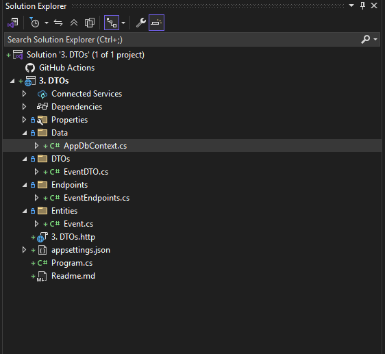
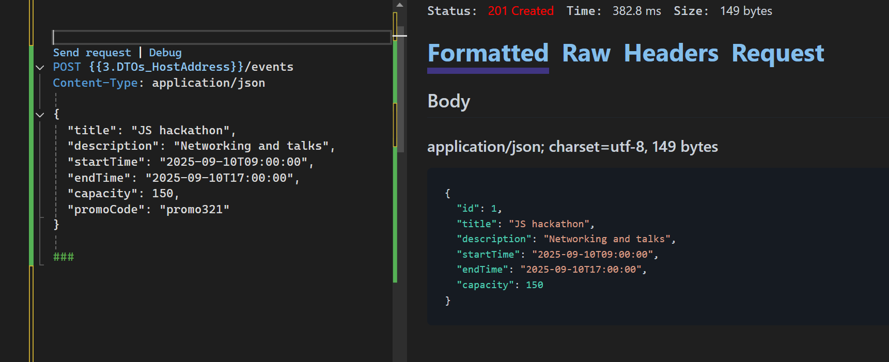
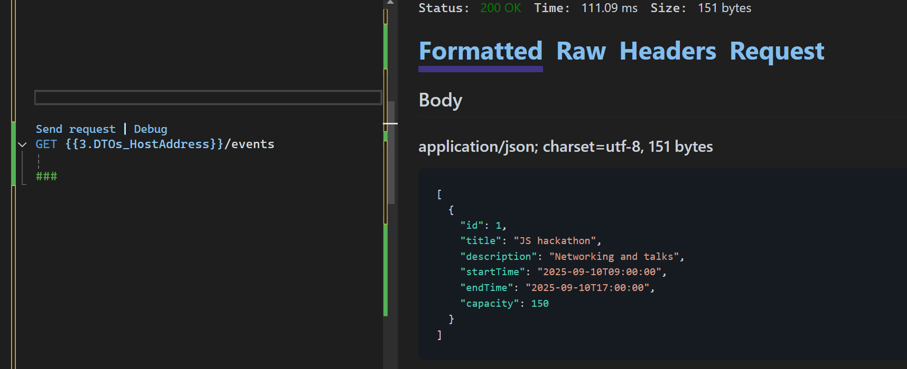

# Data Transfer Object (DTO)

A **Data Transfer Object (DTO)** is a design pattern used to transfer data between different layers or processes within an application, or between an application and an external client (such as a web browser or another service).

## Key Characteristics and Uses of DTOs in .NET

- **Data Encapsulation:**DTOs are simple classes that encapsulate data, mainly consisting of properties, with little to no business logic.
- **Decoupling:**They help decouple different layers (for example, the presentation layer from the domain or database layer) by providing a specific data shape for transfer.
- **Data Shaping and Hiding:**DTOs allow you to control exactly what data is exposed to the client or another layer. This enables you to hide sensitive information, omit unnecessary properties, or flatten complex object graphs.
- **Performance Optimization:**By reducing the amount of data transferred, DTOs can help minimize payload size and improve network performance.
- **Security:**DTOs can help prevent "over-posting" vulnerabilities in web APIs by limiting the properties that can be bound from client requests.
- **Facilitating Mapping:**
  Tools like AutoMapper are commonly used in .NET to simplify the mapping between domain entities and DTOs.

---

## Folder Structure

As your application grows and more features are added, it's important to organize your folders for scalability and maintainability. The following structure is my preference, but you may adjust it to fit your team's needs.

**Create the following folders under your root project:**

- `Data` – Contains `AppDbContext.cs`, which handles interaction with the database context.
- `Entities` – Contains `Event.cs`, representing the database tables.
- `DTOs` – Contains `EventDTO.cs`, which helps prevent over-posting.
- `Endpoints` – Contains `EventEndpoints.cs`, which holds all the related code for an Event.

Below is an illustration of this folder arrangement:



---

## Prevent Over-Posting

In previous codebases, we may have exposed the entire `Event` object. It's best practice to restrict the data that can be input and returned to clients, to avoid exposing sensitive data and reduce vulnerabilities.

Another advantage is that you only return the data needed, using projection queries. This prevents sending too much data (payload) and helps improve application performance.

---

### Entities

**Change:**
In the `Entities` folder, add a `PromoCode` property to the `Event` entity. This property will be used to give discounts to attendees.

```csharp
namespace _3._DTOs.Entities
{
    public class Event
    {
        public int Id { get; set; }
        public string? Title { get; set; }
        public string? Description { get; set; }
        public DateTime StartTime { get; set; }

        public DateTime? EndTime { get; set; }

        public int Capacity { get; set; }

        public string? PromoCode { get; set; }
    }
}

```

---

### DTOs

It is not safe to always expose the `PromoCode` to clients or allow them to input its value, as this could compromise the system. To maintain integrity, only admins should be able to update or view available promo codes.

**In the DTOs folder, add a class `EventDTO.cs` with the following code:**

```csharp
using _3._DTOs.Entities;

namespace _3._DTOs.DTOs
{
    public class EventDTO
    {
        public int Id { get; set; }
        public string? Title { get; set; }
        public string? Description { get; set; }
        public DateTime StartTime { get; set; }

        public DateTime? EndTime { get; set; }

        public int Capacity { get; set; }

        public EventDTO() { }
        public EventDTO(Event @event) =>
            (Id, Title, Description, StartTime, EndTime, Capacity) = (@event.Id, @event.Title, @event.Description, @event.StartTime, @event.EndTime, @event.Capacity); 
  
    }
}

```

#### Breakdown

```csharp
public EventDTO() { }
public EventDTO(Event @event) =>
    (Id, Title, Description, StartTime, EndTime, Capacity) = (@event.Id, @event.Title, @event.Description, @event.StartTime, @event.EndTime, @event.Capacity); 
```

- The above code tells EF Core how to create an instance of `EventDTO` and how to perform projections or queries.

##### Why Use a Parameterless Constructor?

Imagine EF Core is like a chef following a recipe. If the recipe says:

> "Start with a clean empty plate, then add items."

That **empty plate** is like the **parameterless constructor**. Without the plate, the chef has **no place to put the food**.

##### Why You Need a Parameterless Constructor in DTOs

EF Core uses the default (parameterless) constructor to create DTO objects when fetching data from the database. Without it, it can’t create the object and will throw an error during projections or queries.

---

**Example of Projections or Queries in the Codebase:**

A **projection query** is a way to **select specific fields or transform data** from a database query, instead of retrieving the entire entity.

In .NET (using Entity Framework and LINQ), it means we **"project"** data from a database entity (`Event`) into another type — often a **DTO**.

##### Why Use Projection Queries?

1. **Performance:** Only the needed columns are retrieved from the database.
2. **Security:** You avoid exposing sensitive fields (like passwords or internal notes).
3. **Clarity:** You get clean, simplified objects (like `EventDTO`) that are easier to work with in your app or API.

##### Sample Code Without Projection

```csharp
var events = await _context.Events.ToListAsync();
```

##### Example With Projection (Query Projecting to DTO):

```csharp
var events = await _context.Events
    .Select(e => new EventDTO
    {
        Id = e.Id,
        Title = e.Title,
        Description = e.Description,
        StartTime = e.StartTime,
        EndTime = e.EndTime,
        Capacity = e.Capacity
    })
    .ToListAsync();
```

This is **faster** because it doesn’t fetch unneeded data from the database, and **cleaner** because you're directly getting only what the frontend or API needs.

##### What’s Happening Behind the Scenes?

EF Core translates the `Select(...)` into a **SQL query** that only pulls the selected columns. Example SQL generated:

```sql
SELECT Id, Title, Description, StartTime, EndTime, Capacity FROM Events;
```

---

### RouteGroupBuilder

To keep the `Program.cs` file clean, move code related to events into the `Endpoints` folder. Create a file named `EventEndpoints.cs` and add the following code:

```csharp
using _3._DTOs.Data;
using _3._DTOs.DTOs;
using _3._DTOs.Entities;
using Microsoft.EntityFrameworkCore;

namespace _3._DTOs.Endpoints
{
    public static class EventEndpoints
    {
        public static RouteGroupBuilder MapEventEndpoint(this IEndpointRouteBuilder routes)
        {
            //MapGroup API
            var events = routes.MapGroup("/events");

            events.MapPost("/", CreateEvent);
            events.MapGet("/", GetAllEvents);
            events.MapGet("/{id}", GetEvent);
            events.MapPut("/{id}", UpdateEvent);
            events.MapDelete("/{id}", DeleteEvent);

            return events;
        }


        //create an event
        static async Task<IResult> CreateEvent(EventDTO newEventDTO, AppDbContext db)
        {
            var newEvent = new Event
            {
                Id = newEventDTO.Id,
                Title = newEventDTO.Title,
                Description = newEventDTO.Description,
                StartTime = newEventDTO.StartTime,
                EndTime = newEventDTO.EndTime,
                Capacity = newEventDTO.Capacity,
            };

            db.Events.Add(newEvent);
            await db.SaveChangesAsync();

            newEventDTO = new EventDTO(newEvent);
            return TypedResults.Created($"/event/{newEvent.Id}", newEventDTO);
        }

        //get all events
        static async Task<IResult> GetAllEvents(AppDbContext db)
        {
            return TypedResults.Ok(
                await db.Events.Select(e => new EventDTO(e)).ToArrayAsync()
                );
        }


        //get event by id
        static async Task<IResult> GetEvent(int id, AppDbContext db)
        {
            return await db.Events.FindAsync(id)
                is Event @event
                ? TypedResults.Ok(new EventDTO(@event))
                : TypedResults.NotFound();
        }

        //update an event

        static async Task<IResult> UpdateEvent(int id, EventDTO inputEventDTO, AppDbContext db)
        {
            var @event = await db.Events.FindAsync(id);

            if (@event is null) return TypedResults.NotFound();

            @event.Title = inputEventDTO.Title;
            @event.Description = inputEventDTO.Description;
            @event.Capacity = inputEventDTO.Capacity;
            @event.StartTime = inputEventDTO.StartTime;
            @event.EndTime = inputEventDTO.EndTime;

            await db.SaveChangesAsync();
            return TypedResults.NoContent();
        }

        //delete an event
        static async Task<IResult> DeleteEvent(int id, AppDbContext db)
        {
            if (await db.Events.FindAsync(id) is null)
            {
                return TypedResults.NotFound();
            }
            else if (await db.Events.FindAsync(id) is Event @event)
            {
                db.Remove(@event);
                await db.SaveChangesAsync();
                return TypedResults.NoContent();
            }
            return TypedResults.NotFound();
        }
    }
}

```

#### Breakdown

`public static RouteGroupBuilder MapEventEndpoint(this IEndpointRouteBuilder routes)`
This line defines an **extension method** called `MapEventEndpoint`. It's used to group and register all the **event-related API endpoints** (like creating, fetching, updating, or deleting events) to your application's routing system.

This helps keep your API routes clean and organized by **separating event-related routes** into their own method. It improves **readability**, **maintainability**, and **scalability**.

---

#### Map Endpoints

In the **`Program.cs`** file, invoke `MapEventEndpoint()` so that it will have access to the app from the web application builder. The following is the new `Program.cs` file:

```csharp
using _3._DTOs.Data;
using _3._DTOs.DTOs;
using _3._DTOs.Endpoints;
using _3._DTOs.Entities;
using Microsoft.EntityFrameworkCore;

var builder = WebApplication.CreateBuilder(args);

builder.Services.AddDbContext<AppDbContext>(options => options.UseInMemoryDatabase("EventDb"));
builder.Services.AddDatabaseDeveloperPageExceptionFilter();

var app = builder.Build();

//Map Endpoints
app.MapEventEndpoint();

app.Run();

```

---

By following this structure, your application will be ready for scalability and maintainability. You can easily add other endpoints like users, tickets, payments, and more, while keeping the codebase clean.

#### POST Request

Even though I am posting PromoCode as an input field, It does not show up on the output since the DTO helps hide it.




#### Get Request

Similary, when getting all the Events, the PromoCode property is not exposed.




In the next section, we will cover connecting to a database. We will use Microsoft SQL Server to store our data. Later, we will add more endpoints as we conclude our topic on minimal APIs before moving on to controller-based APIs.
